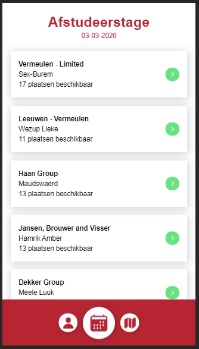
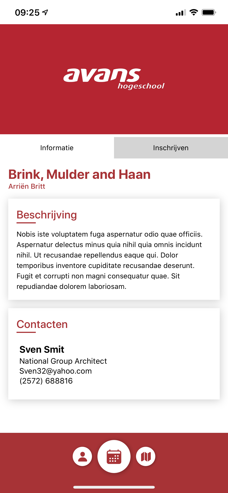
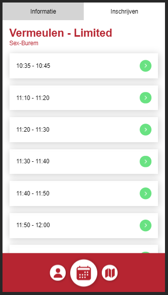
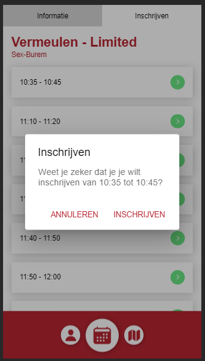
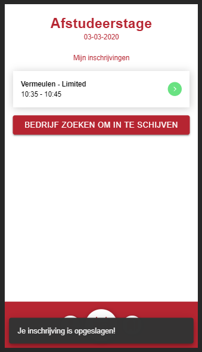
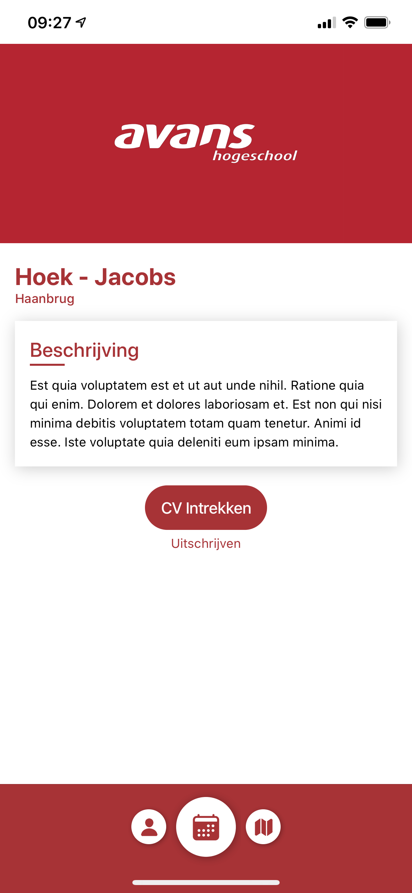

# Bedrijven

In de app kun je een lijst zien met bedrijven die geïnteresseerd zijn in studenten van jouw major.

Als je meer te weten wil komen over het bedrijf kun je op de naam van het bedrijf klikken en krijg je het volgende scherm te zien:

Op dit scherm staat boven aan twee tabjes: informatie & inschrijven. Hieronder staat uitgelegd wat op beide schremen te vinden is.

## Informatie

Bovenaan staat een banner of logo van het bedrijf. Niet ieder bedrijf heeft een banner of logo ingesteld en zal dus ook niet bij ieder bedrijf staan.

Onder de banner staat de naam van het bedrijf met daaronder de plaats waar het bedrijf gevestigd is.

Als je dan verder gaat lezen op deze pagina kom je een korte beschrijving van het bedrijf tegen. Hier kun je meer te weten komen over het bedrijf en kun je zelf bepalen of je je wilt inschrijven bij dit bedrijf voor de speedmeet.

Wil je nog meer te weten komen over het bedrijf of wil je om een andere rede contact opnemen met het bedrijf? Dan staan er onder de beschrijving 1 of meerdere contactpersonen van het bedrijf waar jij contact mee op kunt nemen. Dit zijn mogelijk ook de personen die aanwezig zullen zijn of aanwezig waren op de speedmeet.

## Inschrijven

Als je aan de hand van de informatie van het bedrijf hebt besloten om je in te schrijven bij dit bedrijf op de speedmeet, dan kun je bovenaan de pagina op het tabje inschrijven klikken. Je krijgt dan een overzicht te zien dat er zo uitziet:

Dit is een lijst met alle tijdsloten die nog beschikbaar zijn. Het kan voorkomen dat een tijdslot in deze lijst uitgevaagd is. Dit betekent dat je al op dezelfde tijd bent ingeschreven bij een ander bedrijf. Het kan ook voorkomen dat jij je inschrijft voor een bepaalde tijd bij een bedrijf en iemand anders ook op dezelfde tijd bij hetzelfde bedrijf, dit kan doordat één bedrijf met meerdere mensen naar de speedmeet kan komen en dus ook meerdere tafels kan hebben bij de speedmeet.

Als je een tijd gevonden hebt waarop je je wilt inschrijven bij dit bedrijf tik je daarop en krijg je het volgende scherm te zien:

Door je inschrijving te bevestigen wordt je teruggestuurd naar de homepagina waarop je al je inschrijvingen kunt zien.

## CV delen

Via de app is het mogelijk om je CV te uploaden en te delen met de bedrijven die jij kiest. Als je je hebt ingeschreven bij een bedrijf voor de speedmeet kun je jouw cv delen met dat bedrijf. Dit kun je doen via de informatie pagina van het bedrijf. Onderaan deze pagina staat een knop "CV Vrijgeven" waarmee je aangeeft dat het bedrijf je CV mag inzien.

## CV intrekken

Als je later toch besluit dat het bedrijf niet langer je CV mag inzien kun je dat weer intrekken door op de informatie pagina van het bedrijf op "CV intrekken" te klikken. LET OP: dit geeft geen garantie dat het bedrijf je CV nog niet gedownload heeft.

