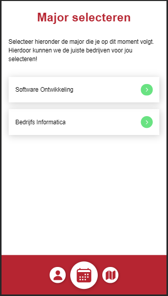

# Major selecteren

Als student moet je, nadat je voor de eerste keer inlogt, je major selecteren. Dit is om de juiste bedrijven aan jou te kunnen laten zien.

Op dit scherm staat een lijst met alle majors die behoren bij jouw opleiding.

## Major wijzigen

Heb je perongelijk een verkeerde major geselecteerd? Dan kun je dat wijzigen via je profiel pagina door op de knop "Andere major selecteren" te klikken.

