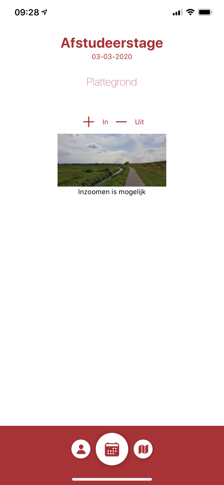

# Speedmeet plattegrond

Als student kan je de plattegrond van de Speedmeet bekijken door op de kaart te klikken die in onderstaand scherm rechtsonderaan te vinden is. Op de kaart staan de locaties van de verschillende bedrijven gedurende de Speedmeet. Door de knoppen "+ In" en "- Uit" te gebruiken kun je in- en uitzoomen op de kaart. Dit kan ook door twee vingers op de kaart te plaatsen en deze van elkaar af of naar elkaar toe te bewegen.

