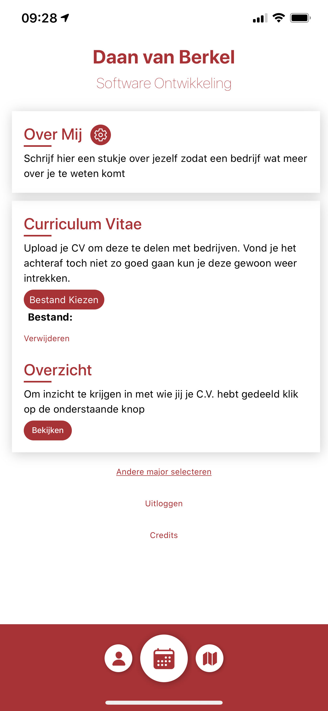
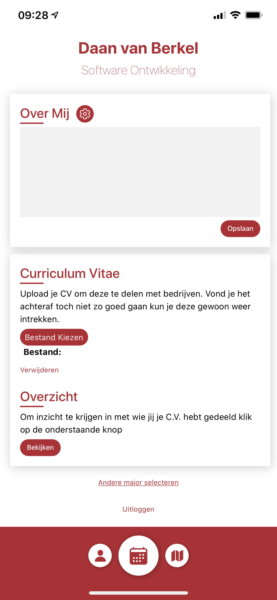
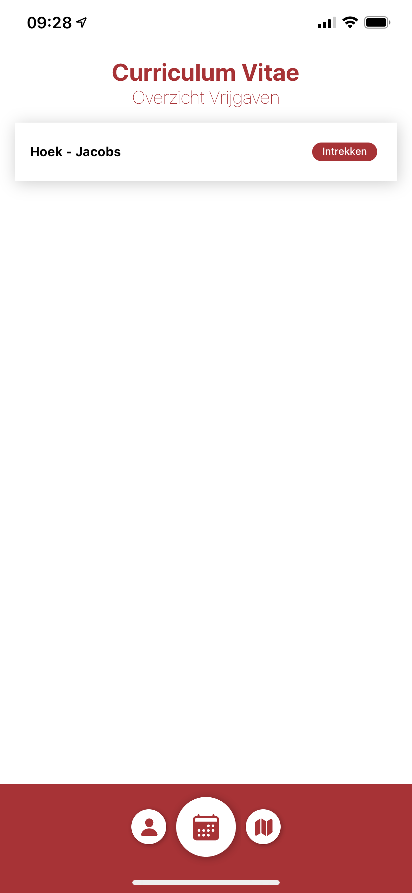

# Profiel van een student

Als student ben je in het bezit van je eigen profiel. Dit profiel kan door een bedrijf bekeken worden.
In het onderstaande scherm kun je als student zien wat je naam is en welke major je op dit moment volgt.

## Over mij

Daarnaast heb je de mogelijkheid om een stukje over jezelf te schrijven. Hierdoor krijgt een bedrijf een beter beeld van met wie ze in gesprek gaan.

Om de "Over Mij" tekst aan te kunnen passen klik je op het Avans rode tandwiel. Je zal dan onderstaand scherm te zien krijgen. Door op "opslaan" te klikken sla je de door jou opgegeven tekst daadwerkelijk op.

## CV

Een andere manier om een bedrijf een beter beeld van jou als student te geven is door je C.V. met een bedrijf te delen. Hiervoor is het tweede gedeelte van het profiel bedoeld. In onderstaand scherm kan je een C.V. uploaden. Daarnaast kun je bekijken aan wie jou C.V. is vrijgegeven door op "Bekijken" te klikken.

Als je een bestand hebt gekozen om te uploaden als je CV kun je op "Uploaden" klikken om dit te bevestigen en het C.V. op te slaan. Mocht je het verkeerde C.V. hebben geüpload kan je door op "Verwijderen" te klikken je C.V. weer verwijderen.

## Uitloggen

Tot slot kan je je zelf uitloggen door op de "Uitloggen" link te klikken die onderaan op de profiel pagina is te vinden.
