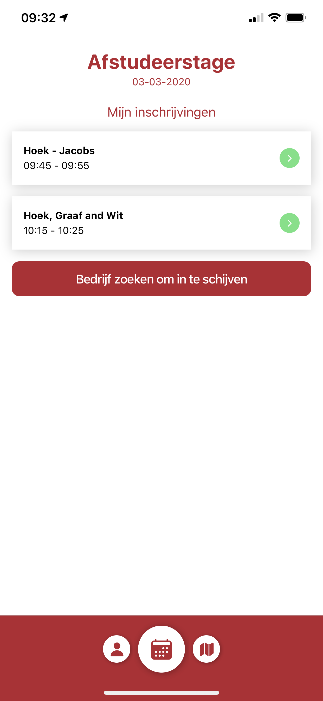
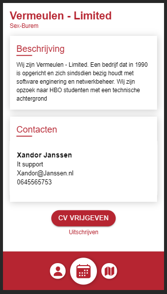
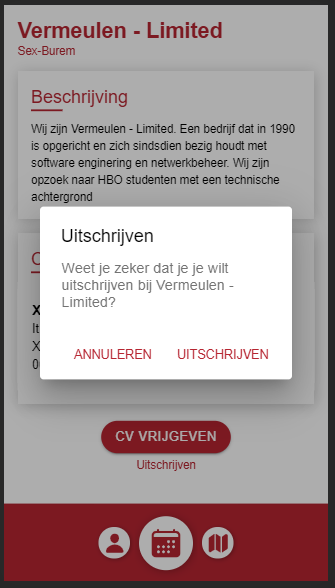

# Uitschrijven bij een bedrijf

In de onderstaande lijst staan de bedrijven waarmee je een gesprek hebt tijdens de Speedmeet. Door op een bedrijf te klikken zul je op de detail pagina van een bedrijf komen.

In het onderstaande scherm kun je onderaan de pagina kiezen om je weer uit te schrijven bij dit bedrijf. Als je op de link "Uitschrijven" klikt zal er om een bevestiging gevraagd worden.

Als je een bevestiging geeft ben je niet langer ingeschreven bij dit bedrijf.

