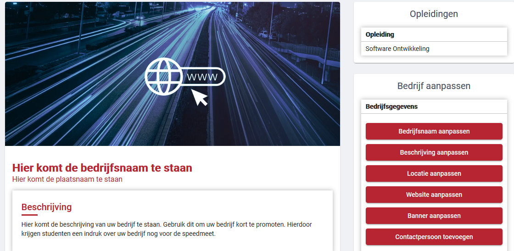
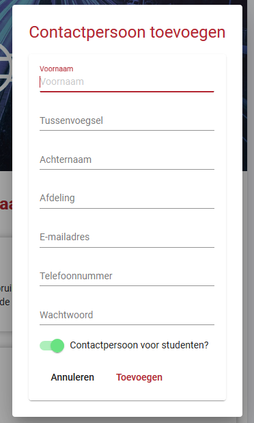

# Bedrijf beheren

Op dit scherm kunt u de gegevens van uw bedrijf beheren. Links is een weergave van hoe een student uw bedrijfspagina zal zien in de app. Rechts vind u de knoppen om de gegevens op deze weergave te veranderen. Deze knoppen openen een popup waar u de nieuwe gegevens in kunt voeren.

De bedrijfsgegevens die u hier aan kunt passen zijn:

- De bedrijfsnaam
- Bedrijfs beschrijving
- De locatie van uw bedrijf
- De link naar uw website
- De bovenstaande banner, waar u mogelijk uw logo kunt plaatsen (limiet van 3MB)

# Contactpersonen weergave

De contactpersonen zullen onder de bedrijfsgegevens te vinden zijn.

Hier zullen alle contactpersonen van uw bedrijf te vinden zijn. Er zijn twee type contactpersonen die toegevoegd kunnen worden:

- Contactpersonen voor de studenten (aangegeven met een sterretje)
- Contactpersonen van uw bedrijf

De contactpersonen van uw bedrijf zijn de personen die contact hebben met Avans. Deze zijn niet zichtbaar voor de studenten.

In deze weergave krijgt u de opties, van links naar recht, om:

- Uw wachtwoord aan te passen, als u ingelogd bent als desbetreffend contactpersoon.
- Een contactpersoon aan te passen.
- Een contactpersoon te verwijderen, als u een contactpersoon verwijderd zal deze ook niet meer in kunnen loggen.

# Contactpersonen aanmaken

Om een contactpersoon aan te maken is er een knop aan de rechterkant van het scherm te vinden. Dit scherm zal een popup openen waar u de gegevens van een nieuw contactpersoon kunt invoeren. Deze nieuwe contactpersoon zal dan ook kunnen inloggen om de bedrijfsgegevens te beheren.

# Geïnteresseerde opleidingen

De laatste knop in het overige tabje is het aanpassen van geïnteresseerde opleidingen. In dit scherm kunt u selecteren van welke opleiding u stagiaires wilt spreken tijdens de speedmeet.

