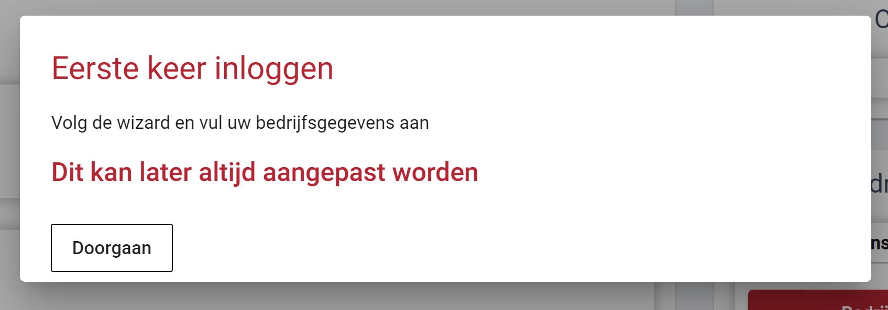
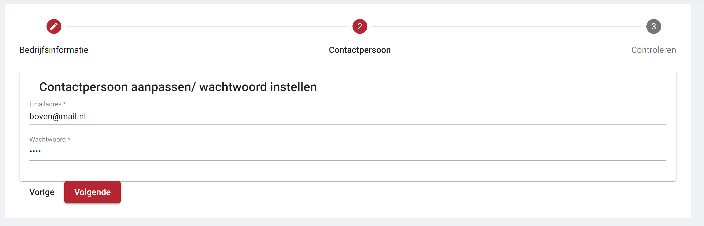

# Registratieproces

Het registratie process van een bedrijf loopt via een wizard. Zodra de eerste ingelogd wordt verschijnt er een dialog. Door op doorgaan te klikken wordt de wizard geopent 

## Wizard - Bedrijfsgegevens

Op de eerste pagina van de wizard wordt er gevraagd om de algemene bedrijfs gegevens in te vullen. Het veld van de bedrijfsnaam moet verplicht ingevuld worden.

* al de gegevens op deze pagin kunnen later door het bedrijf of de beheerder aangepast worden

## Wizard - Contactpersoon

Op de tweede pagina van de wizard moet moet het wachtwoord aangepast worden van de contactpersoon en is het mogelijk om het email te veranderen.

* al de gegevens op deze pagin kunnen later door het bedrijf of de beheerder aangepast worden

## Wizard - Overzicht

De laatste pagina van de wizard is een overzicht van al de ingevulde inforamtie, als deze informatie klopt kan deze bevestigd worden. Vervolgens zal het bedrijfsprofiel en de contactpersoon aangevuld worden en kan de contactpersoon inloggen met zijn nieuwe wachtwoord.

* al de gegevens op deze pagin kunnen later door het bedrijf of de beheerder aangepast worden

