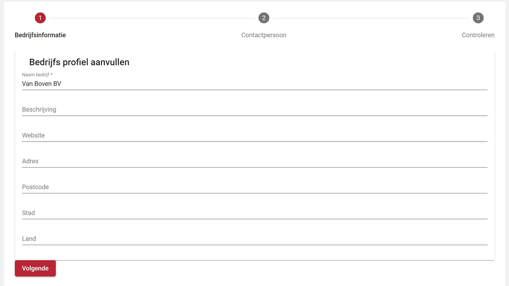

# Registratieproces

Het registratie process van uw bedrijf loopt via een wizard. Zodra de eerste ingelogd wordt verschijnt er een dialog. Door op doorgaan te klikken wordt de wizard geopent 

## Wizard - Bedrijfsgegevens

Op de eerste pagina van de wizard wordt er gevraagd om algemene gegevens van uw bedrijf. Het veld van de bedrijfsnaam moet verplicht ingevuld worden.

!> Alle gegevens op deze pagina kunnen later door u of de beheerder aangepast worden.

## Wizard - Contactpersoon

Op de tweede pagina van de wizard moet u het wachtwoord aanpassen en is het mogelijk om het emailadres te veranderen.

!> Alle gegevens op deze pagina kunnen later door u of de beheerder aangepast worden.

## Wizard - Overzicht

De laatste pagina van de wizard is een overzicht van al de ingevulde informatie, als deze informatie klopt kan deze bevestigd worden. Vervolgens zal het bedrijfsprofiel en de contactpersoon aangevuld worden en kunt u inloggen met uw nieuwe wachtwoord.

!> Alle gegevens op deze pagina kunnen later door u of de beheerder aangepast worden.

