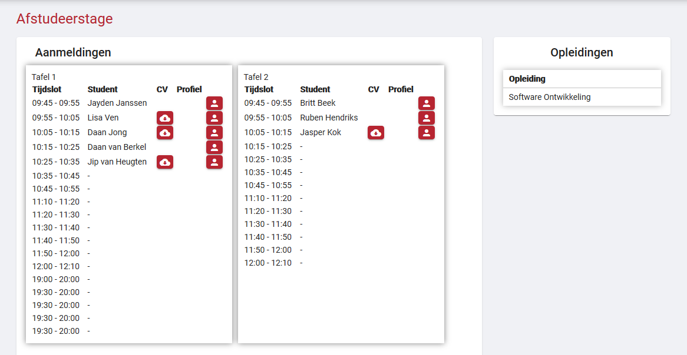

# Student gegevens bekijken

Onder de knoppen om uw bedrijfsgegevens te beheren zijn er nog een aantal knoppen te vinden.

Als u op de knop "Ingeschreven studenten" drukt, komt u op een weergave waar de tafels voor uw bedrijf te zien zijn. Bij iedere tafel staat een lijst met tijdsloten van de speedmeet. Ingeschreven studenten verschijnen achter een tijdslot als ze zich daarvoor inschrijven. Achter een student zijn nog twee knoppen te vinden. De eerste knop word zichtbaar als een student zijn/haar CV wil vrijgeven aan uw bedrijf. Als u op de knop klikt, kunt u het CV downloaden. De tweede knop is een profiel knop waar u kort wat informatie kunt lezen over de student. Deze informatie moet dan wel zelf ingevuld zijn door de student.

