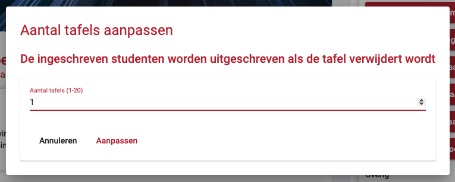
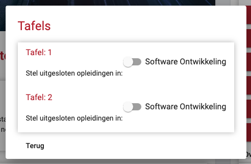

# Bedrijf beheren

Op dit scherm kunt u de gegevens van het bedrijf beheren. Links is een weergave van hoe een student de bedrijfspagina zal zien in de app. Rechts vind u de knoppen om de gegevens op deze weergave te veranderen. Deze knoppen openen een popup waar u de nieuwe gegevens in kunt voeren.

De bedrijfsgegevens die u hier aan kunt passen zijn:

- De bedrijfsnaam
- Bedrijfs beschrijving
- De locatie van het bedrijf
- De link naar het website
- De bovenstaande banner, waar u mogelijk een logo kunt plaatsen (limiet van 3MB)

## Contactpersonen weergave

De contactpersonen zullen onder de bedrijfgegevens te vinden zijn.

Hier zullen alle contactpersonen van het bedrijf te vinden zijn. Er zijn twee type contactpersonen die toegevoegd kunnen worden:

- Contactpersonen voor de studenten (aangegeven met een sterretje)
- Contactpersonen van het bedrijf

De contactpersonen van het bedrijf zijn de personen die contact hebben met Avans. Deze zijn niet zichtbaar voor de studenten.

In deze weergave krijgt u de opties, van links naar recht, om:

- Een contactpersoon aan te passen.
- Een contactpersoon te verwijderen, als u een contactpersoon verwijderd zal deze ook niet meer in kunnen loggen.

## Contactpersonen aanmaken

Om een contactpersoon aan te maken is er een knop aan de rechterkant van het scherm te vinden. Dit scherm zal een popup openen waar u de gegevens van een nieuw contactpersoon kunt invoeren. De nieuwe contactpersoon zal dan ook in kunnen loggen om deze gegevens te beheren.

## Ingeschreven studenten

Om een weergave te krijgen van welke studenten zich ingeschreven hebben voor de speedmeet, is er onder de bedrijfsgegevens knoppen nog de overige knoppen te vinden.

Als u op de knop "Ingeschreven studenten" drukt, komt u op een weergave waar de aan dit bedrijf gereserveerde tafels te zien zijn. Bij iedere tafel staat een lijst met tijdsloten van de speedmeet. Ingeschreven studenten verschijnen achter een tijdslot als ze zich daarvoor inschrijven. Achter een student zijn nog twee knoppen te vinden. De eerste knop word zichtbaar als een student zijn/haar CV wil vrijgeven aan het bedrijf. Als u op de knop klikt, kunt u het CV downloaden. De tweede knop is een profiel knop waar u kort wat informatie kunt lezen over de student. Deze informatie moet dan wel zelf ingevuld zijn door de student.

## Geïnteresseerde opleidingen

De laatste knop in het overige tabje is het aanpassen van geïnteresseerde opleidingen. In dit scherm kunt u selecteren van welke opleiding studenten zich kunnen inschrijven voor dit bedrijf.

## Aantal tafels beheren

U kunt voor een bedrijf aangeven hoeveel tafels het bedrijf gebruikt tijdens de speedmeet. Dit kunt u doen door op de knop "Aantal tafels aanpassen" te klikken. U krijgt dan een dialog te zien waar u het aantal tafels kunt aanpassen.

!> Als u het aantal naar beneden aanpast en er waren al studenten ingeschreven bij die tafel, worden deze inschrijvingen verwijderd.

## Opleiding uitsluiten voor een tafel

U kunt per tafel aangeven welke opleidingen er **geen** gebruik mogen maken van die tafel. Bijvoorbeeld: Een bedrijf heeft twee tafels op de speedmeet en u wilt één tafel specifiek voor informatica studenten, dan kun u de opleiding informatica uitsluiten voor alle andere tafels en de andere opleidingen uitsluiten voor de tafel van informatica.

Om de opleidingen per tafel in te stellen klikt u op de knop "Tafels beheren" u krijgt dan een dialog te zien waarop alle tafels te zien zijn met de opleidingen.

