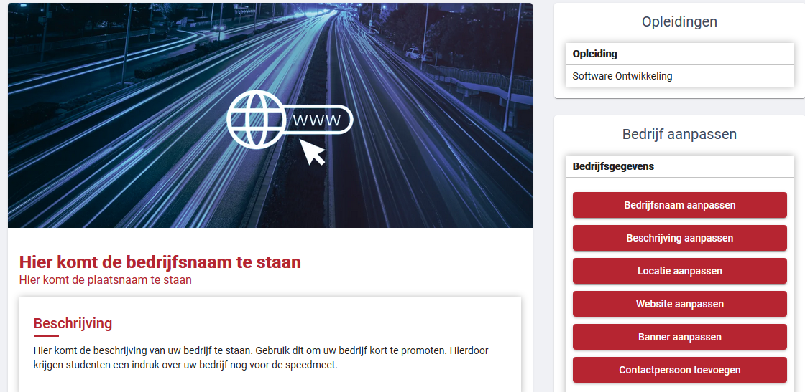
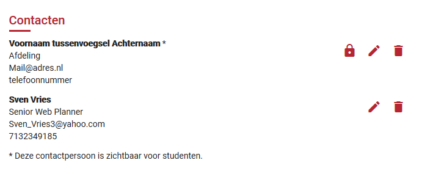
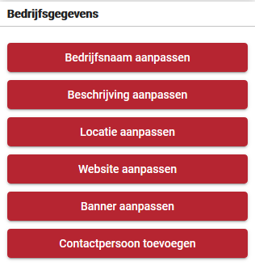
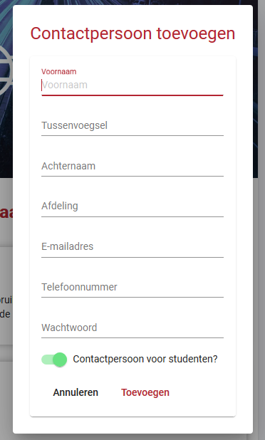
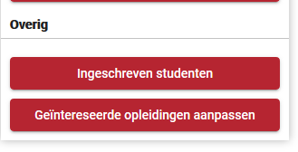
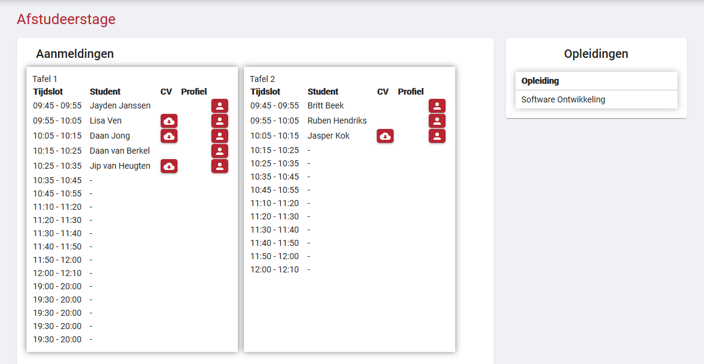
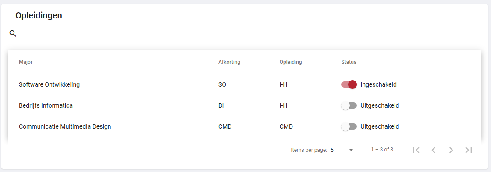

# Bedrijf beheren

Op dit scherm kunt u uw bedrijf beheren.

Links is een weergave van hoe een student uw bedrijfspagina zal zien in de app.

Rechts vind u de knoppen om de gegevens op deze weergave te veranderen.

Deze knoppen openen een popup waar u de nieuwe gegevens in kunt voeren.

De bedrijfsgegevens die u hier aan kunt passen zijn:

- De bedrijfsnaam

- Bedrijfs bedschrijving

- De locatie van uw bedrijf

- De link naar uw website

- De bovenstaande banner, waar u mogelijk uw logo kunt plaatsen (limiet van 3MB)

# Contactpersonen weergave

De contactpersonen zullen onder de bedrijfgegevens te vinden zijn.

Hier zullen alle contactpersonen van uw bedrijf te vinden zijn voor:

- Contactpersonen voor de studenten (aangegeven met een sterretje)

- Contactpersonen van uw bedrijf

De contactpersonen van uw bedrijf zijn de personen die contact hebben met Avans.

Deze zijn niet zichtbaar voor de studenten.

In deze weergave krijgt u de opties van links naar recht om:

- Uw wachtwoord aan te passen als u ingelogd bent als desbetreffend contactpersoon

- Een contactpersoon aan te passen

- Een contactpersoon te verwijderen

# Contactpersonen aanmaken

Om een contactpersoon aan te maken is er een knop aan de rechterkant van het scherm te vinden.

Dit scherm zal een popup openen waar u de gegevens van een nieuw contactpersoon kunt invoeren

# ingeschreven studenten

Om een weergave te krijgen van welke studenten zich ingeschreven hebben voor de speedmeet, is er onder de bedrijfsgegevens

knoppen nog de overige knoppen te vinden.

Als u op de knop "Ingeschreven studenten" drukt, komt u op een weergave van de aan u gereserveerde tafels te zien.

Bij iedere tafel staat een lijst met tijdsloten van de speedmeet. Ingeschreven studenten verschijnen achter een tijdslot als

ze zich daarvoor inschrijven.

Achter een student zijn nog twee knoppen te vinden. De eerste knop word zichtbaar als een student zijn/haar CV wil vrijgeven

aan uw bedrijf. Als u op de knop klikt, kunt u het CV downloaden.

De tweede knop is een profiel knop waar u kort wat informatie kunt lezen over de student. Deze informatie moet dan wel zelf

ingevuld zijn door de student.

# Geïntereseerde opleidingen

De laatste knop in het overige tabje is het aanpassen van Geïntereseerde opleidingen.

In dit scherm kunt u selecteren van welke opleiding u stagiaires wilt spreken tijdens de speedmeet.

