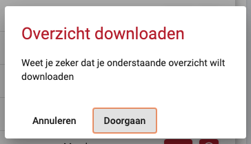
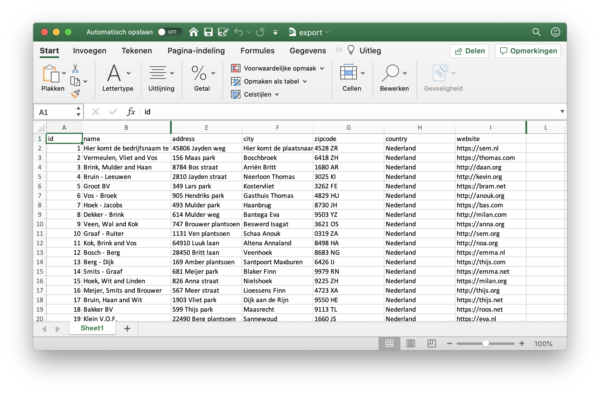

# Bedrijven exporteren

U heeft de mogelijkheid om na een speedmeet alle deelnemende bedrijven te exporteren. Dit kunt u doen door in het speedmeet overzicht op de knop "Bedrijven beheren" te klikken en daarna op de knop "Exporteer deelnemende bedrijven". U krijgt een dialog te zien waarop u kunt bevestigen dat u de lijst wilt downloaden. Daarna krijgt u een excel bestand aangeboden met daarin alle deelnemende bedrijven.

!> Als u een lijst wilt hebben met alle deelnemende bedrijven moet u deze exporteren vóórdat u de speedmeet reset. Anders kunt u de lijst met deelnemende bedrijven niet meer exporteren.

