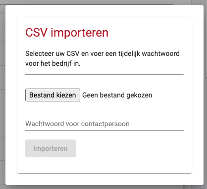

# Bedrijven importeren

U heeft de mogelijkheid om meerdere bedrijven in één keer te importeren via een CSV bestand. U kunt dit [template](../media/bedrijven-template.csv ':ignore') gebruiken om de bedrijven te importeren (dit is hetzelfde formaat als de export vanuit SAM, u kunt de export vanuit SAM direct importeren op dit systeem). De CSV kunt u uploaden door in het speedmeet overzicht op de knop "Bedrijven beheren" te klikken en daarna op de knop "Importeer CSV". U krijgt nu een dialog te zien waarin u de CSV kunt uploaden en waar u een standaard wachtwoord kunt invoeren voor alle contactpersonen van de bedrijven.

?> De contactpersonen moeten het wachtwoord aanpassen als ze voor de eerste keer inloggen.

