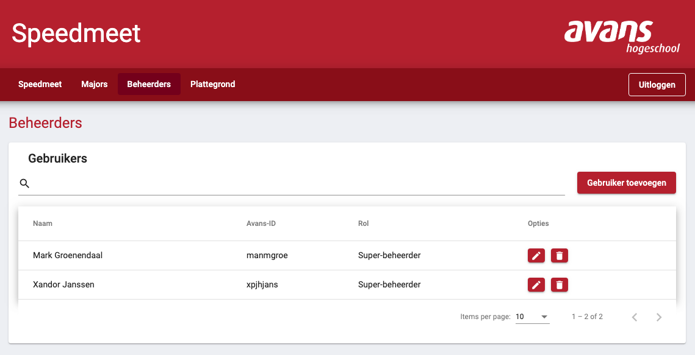
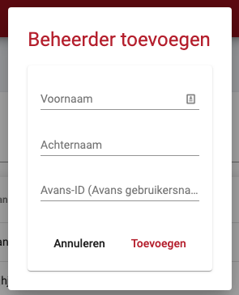
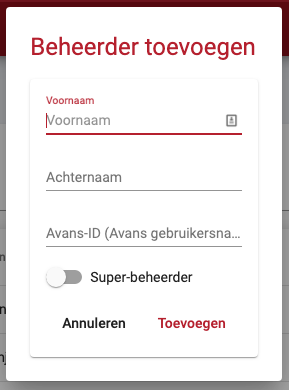
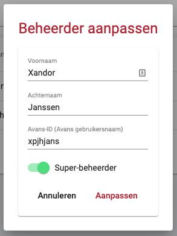
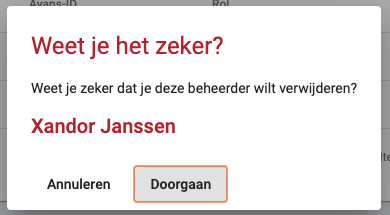

# Beheerders beheren

U heeft de mogelijkheid om beheerders en super-beheerders aan te maken. Beheerders kunnen alleen medewerkers van Avans zijn. Een beheerder krijgt volledige toegang tot het beheer deel van de speedmeet en de studenten app. U kunt via het menu op de knop "Beheerders" klikken om het scherm met alle beheerder te openen.

## Verschil tussen beheerder en super-beheerder

Er bestaan twee verschillende soorten beheerders, namelijk een beheerder en super-beheerder. Een super-beheerder het de volgende extra bevoegdheden:

- Nieuwe super-beheerder aanmaken
- Super-beheerder aanpassen
- Super-beheerder verwijderen
- Speedmeet resetten

Een 'standaard' beheerder kan dit dus **niet**.

## Beheerder toevoegen

Door op de knop "Gebruiker toevoegen" te klikken opent er een dialog waar u de voornaam, achternaam en het Avans-ID (dit is hetzelfde als de Avans gebruikersnaam) van de beheerder moet invoeren.

!> Het is hierbij belangrijk dat het Avans-ID juiste wordt ingevoerd, anders heeft de medewerker **geen** toegang tot het systeem.

### Super-beheerder toevoegen

Om een super-beheerder toe te kunnen voegen moet u zelf een super-beheerder zijn. Als u als super-beheerder op de knop "Gebruiker toevoegen" klikt krijgt u een extra optie in het dialog te zien waarmee u kunt aangeven of de gebruiker een super-beheerder is.

## Beheerder aanpassen

Door op de knop met het potlootje achter een beheerder te klikken krijgt u een dialog te zien waarmee u de gegevens van de beheerder kunt aanpassen.

?> Alleen een super-beheerder krijgt de optie te zien om een beheerder te veranderen van of naar super-beheerder.

## Beheerder verwijderen

Door op de knop met het prullenbakje achter een beheerder te klikken kunt u een beheerder verwijderen. U krijgt dan eerst nog een dialog te zien waarop u moet bevestigen dat u de beheerder wilt verwijderen.

?> Alleen een super-beheerder kan een andere super-beheerder verwijderen.

!> Als u alle super-beheerders verwijderd is het **niet** meer mogelijk om een andere super-beheerder aan te maken via het systeem zelf.
