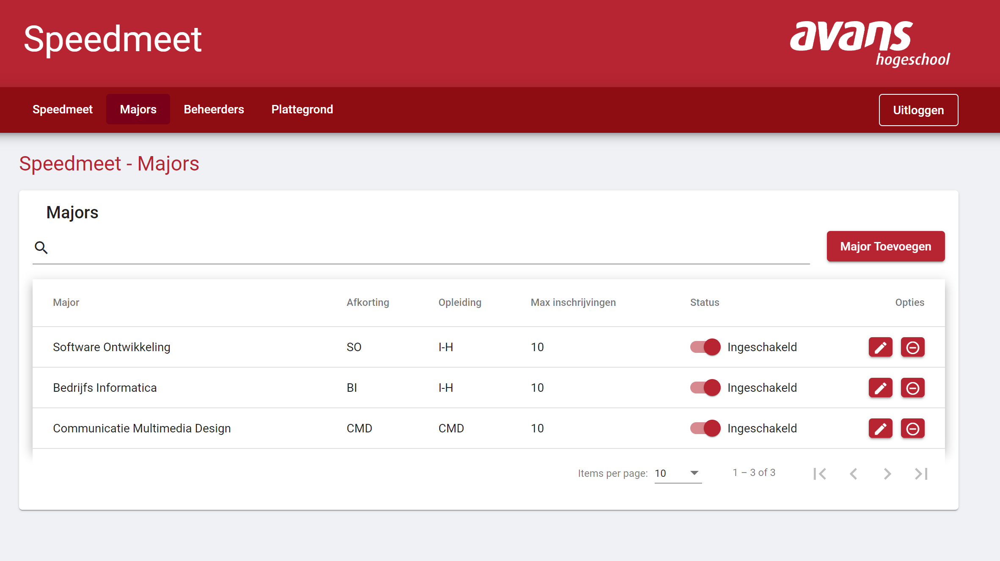
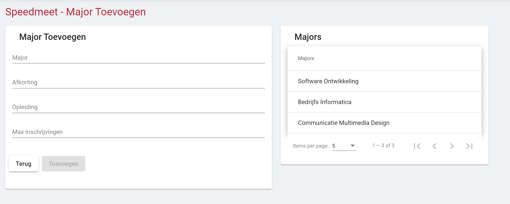
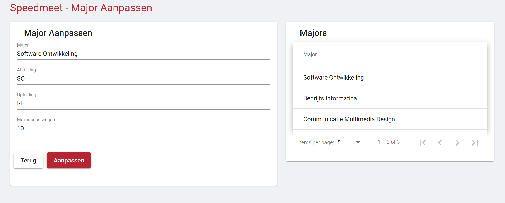
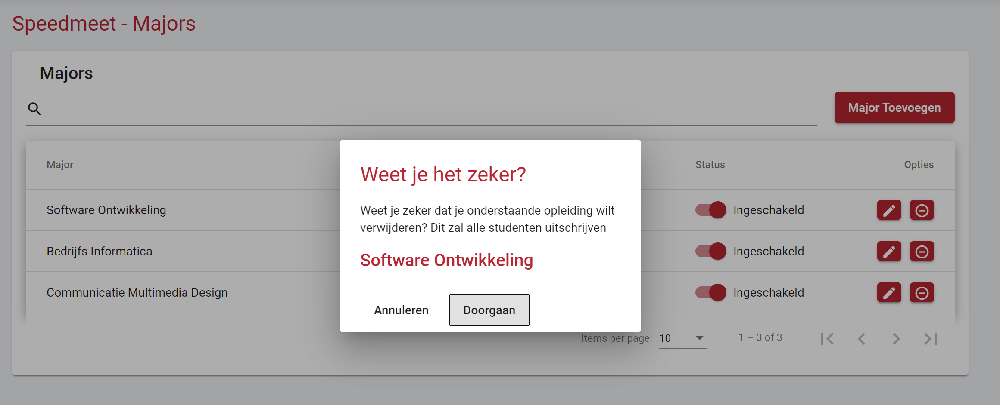

# Majors Beheeren

Binnen de web-applicatie kunnen majors beheerd worden. Majors zijn ervoor dat bedrijven kunnen kiezen van welke major studenten kunnen inschrijven en dat bij het inloggen in de app een student een major kan kiezen

De knop voor het beheeren van majors is te vinden in het menu bovenaan de webste

## Majors - Overzicht

Op de pagina majors is een overzicht van alle majors, een knop voor het toevoegen van een major en een zoek balk.

Overzicht: In dit overzicht staan al de majors die ooit in het systeem zijn ingegeven, aan de slider is te zien of de major op dit moment actief is (Gekozen kan worden door bedrijf en student). Ook zijn er twee knoppen te vinden. De knop met het potloodje opend het scherm voor het updaten van een major. De knop met het rondje waar een streepje in staat opent een dialog voor het verijderen van een major.

Zoekbalk: Deze zoekbalk filterd de tabel op basis van een ingegeven zoekopdracht.

Knop major toevoegen: opent de pagina voor het toevoegen van een major.

## Majors - Toevoegen

Op deze pagina is het mogelijk om een major toe te voegen aan het systeem. Aan de linker kant van de pagina is een formulier te vinden om een major toe te voegen en aan de rechter kant een kort overzicht met al de majors die op dit moment in het systeem staan.

Formulier velden:
Al de velden in het formulier zijn verplicht

 - Major: Naam van de major (Bijvoorbeeld: Software ontwikkeling)
 - Afkorting: Afkrting van een major (Bijvoorbeeld: SO)
 - Opleiding: De naam van de opleiding waar de major ondervalt (Bijvoorbeeld: Informatica)
 - Max inschijvingen: Het maximaal aantal inschijvingen van studenten die onder deze major vallen per bedrijf (Bijvoorbeeld: 10) 

Door vervolgens op de knop toevoegen te drukken wordt de major toegevoegd and wordt er terug genavigeerd naar de overzichtspagina.

## Majors - Aanpassen

De pagina aanpassen werkt op dezelde manier als "Majors - Toevoegen" alleen worden hier de gegevens van de major al ingevuld.

## Majors - Activeren

Door de slider te verplaatsten wordt een major in of uitgeschakeld, dit betekend dat de major gekozen kan worden (Ingeschakeld) of niet (Uitgeschakeld)

## Majors - Verijderen

In deze dialog wordt nog een keer gevraagd of het zeker is dat de major verwijdert moet worden.

