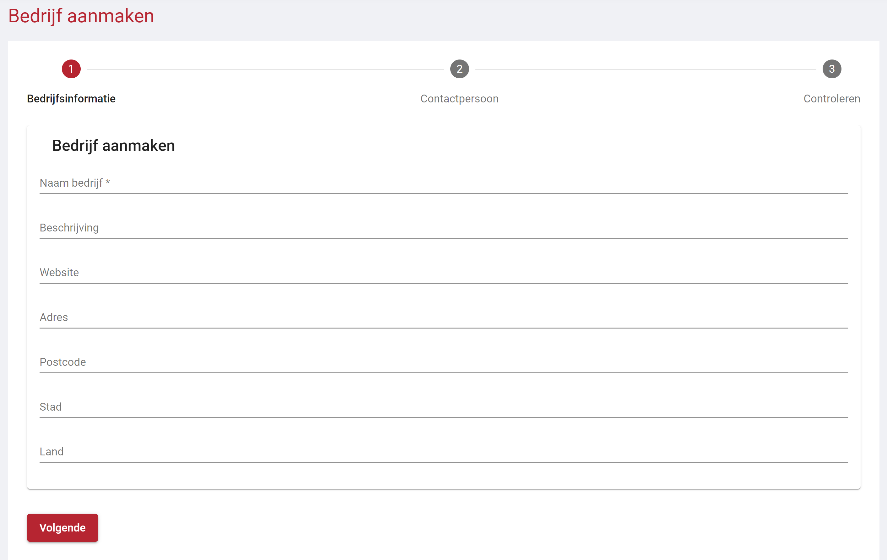
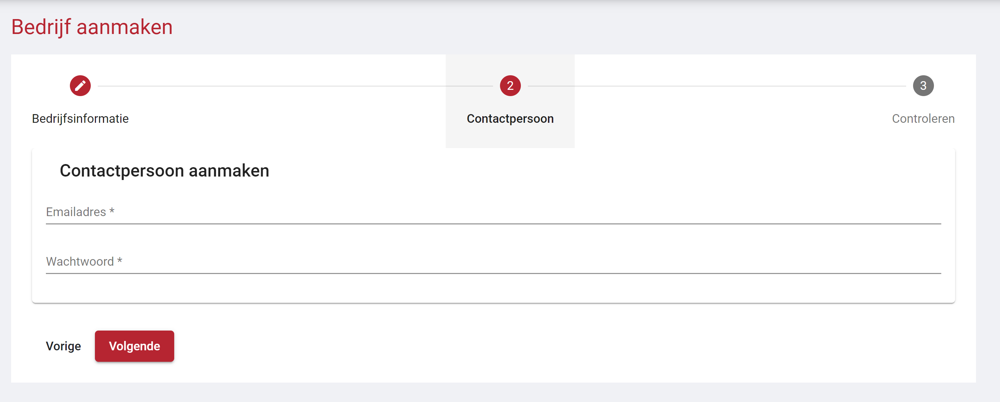
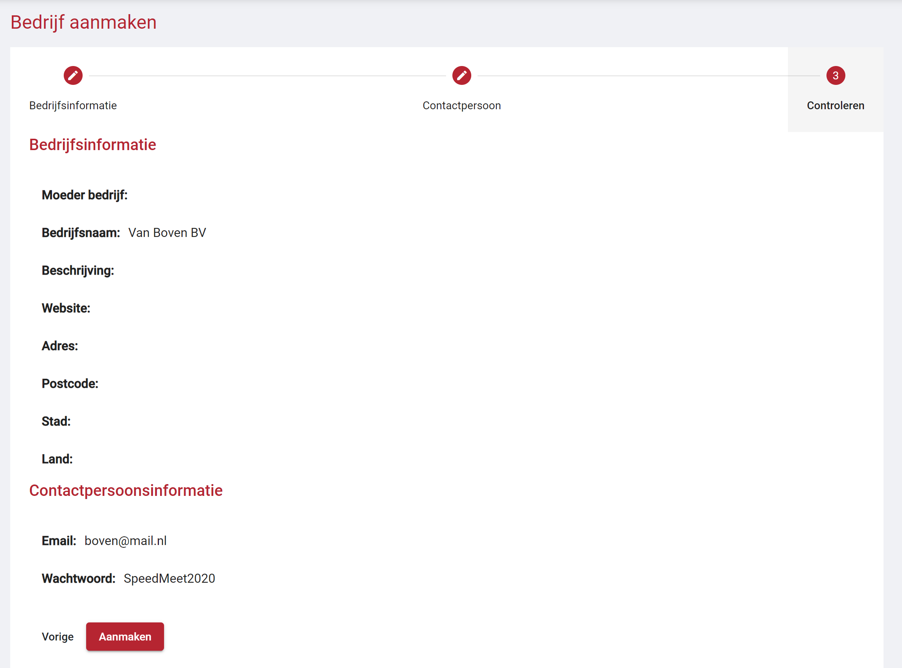

# Registratieproces

?> U heeft ook de mogelijkheid om bedrijven in batch te importeren. [Klik hier](web/bedrijven-importeren.md) voor meer informatie.

Het registratie process voor een bedrijf loopt via een wizard. De knop naar deze wizard kan gevonden worden op de pagina "Bedrijven beheren" in het het menu aan de rechter kant.

## Wizard - Bedrijfsgegevens

Op de eerste pagina van de wizard wordt er gevraagd om de algemene bedrijfs gegevens in te vullen. Het veld van de bedrijfsnaam moet verplicht ingevuld worden.

!> Alle gegevens op deze pagina kunnen later door een contactpersoon of u, de beheerder, aangepast worden.

## Wizard - Contactpersoon

Op de tweede pagina van de wizard moet er een account aangemaakt worden voor de eerste contactpersoon van het bedrijf. Deze gegevens vormen de login gegevens. Het wachtwoord wat hier ingevuld wordt is een tijdelijk wachtwoord. De contactpersoon wordt na de eerste keer inloggen verplicht dit wachtwoord aan te passen.

!> Alle gegevens op deze pagina kunnen later door een contactpersoon of u, de beheerder, aangepast worden.

## Wizard - Overzicht

De laatste pagina van de wizard is een overzicht van al de ingevulde informatie, als deze informatie klopt kan deze bevestigd worden. Vervolgens zal het bedrijfsprofiel en de contactpersoon opgeslagen worden en kan de contactpersoon inloggen.

!> Alle gegevens op deze pagina kunnen later door een contactpersoon of u, de beheerder, aangepast worden.

