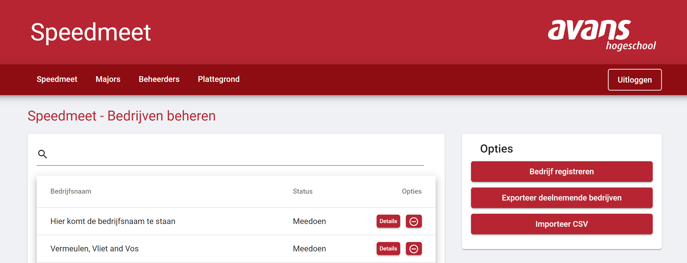

# Registratieproces

Het registratie process voor een bedrijf loopt via een wizard. De knop naar deze wizard kan gevonden worden op de pagina "Bedrijven beheeren" in het het menu aan de rechter kant.

## Wizard - Bedrijfsgegevens

Op de eerste pagina van de wizard wordt er gevraagd om de algemene bedrijfs gegevens in te vullen. Het veld van de bedrijfsnaam moet verplicht ingevuld worden.

* al de gegevens op deze pagin kunnen later door het bedrijf of de beheerder aangepast worden

## Wizard - Contactpersoon

Op de tweede pagina van de wizard moet er een account aangemaakt worden voor de eerste contactpersoon van het bedrijf. Deze gegevens vormen de login gegvens. Het wachtwoord wat hiet ingevuld wordt is een tijdelijk wachtwoord. De contact persoon wordt na de eerste keer inloggen verplicht dit wachtwoord aan te passen

* al de gegevens op deze pagin kunnen later door het bedrijf of de beheerder aangepast worden

## Wizard - Overzicht

De laatste pagina van de wizard is een overzicht van al de ingevulde inforamtie, als deze informatie klopt kan deze bevestigd worden. Vervolgens zal het bedrijfsprofiel en de contactpersoon opgeslagen worden en kan de contactpersoon inloggen.

* al de gegevens op deze pagin kunnen later door het bedrijf of de beheerder aangepast worden

