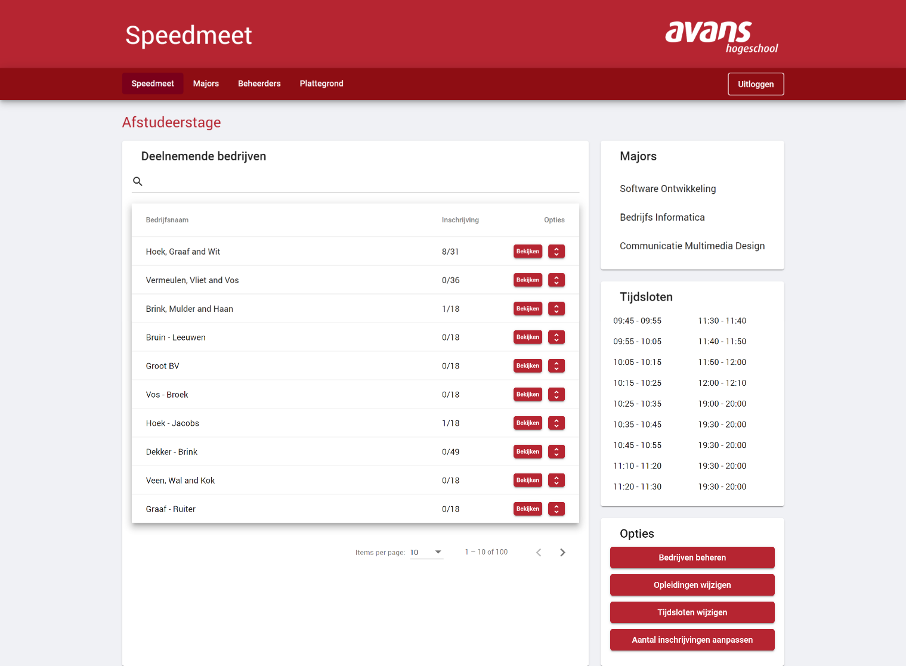
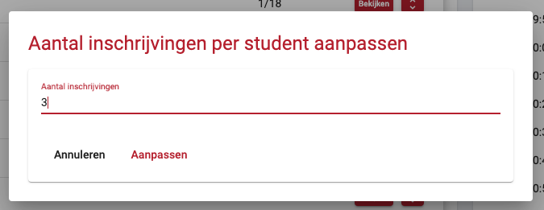

# Speedmeet overzicht
In dit overzicht kun je een lijst zien (en zoeken) van alle bedrijven die meedoen aan de huidige speedmeet. Per bedrijf kun je makkelijk in een overzicht zien welke studenten zich hebben ingeschreven per bedrijf, dit doe je door op de pijltjes te klikken in de tabel. Aan de rechterkant is te zien in zogenaamde 'cards' welke majors zich kunnen inschrijven, welke tijdsloten er nu aangemaakt zijn en beheer opties voor de speedmeet.

Vanuit dit overzicht heb je de volgende mogelijkheden:

- [Bedrijven beheren](web/bedrijven-beheren.md)
- [Opleidingen wijzigen (ook wel majors)](web/majors.md)
- [Tijdsloten wijzigen](web/tijdsloten-beheren.md)
- Het aantal inschrijvingen per student aanpassen

## Aantal inschrijven per student

Met de knop "Aantal inschrijvingen aanpassen" op de overzichts pagina van de speedmeet kunt u aanpassen bij hoeveel bedrijven één student zich kan inschrijven. Als u op deze knop drukt krijgt u een dialog te zien waarin u het aantal kunt aanpassen. 

?> Als u het aantal naar beneden aanpast en een student heeft zich daardoor te vaak ingeschreven, blijven deze inschrijvingen toch bestaan.

## Reset speedmeet
Met de knop "Reset speedmeet" is het mogelijk om alle gegevens van de speedmeet te resetten, zodat je bij een volgende speedmeet geen achtergebleven informatie hebt. De volgende gegevens worden gereset:

- Leeghalen en opnieuw genereren van tijdsloten en rondes.
- Verwijderen van student data (profiel, CV).
- Verwijderen van majors.
- Bedrijven die op 'Meedoen' staan, terugzetten naar 'Geregistreerd'.

!> Alleen een superbeheerder kan de speedmeet resetten.

