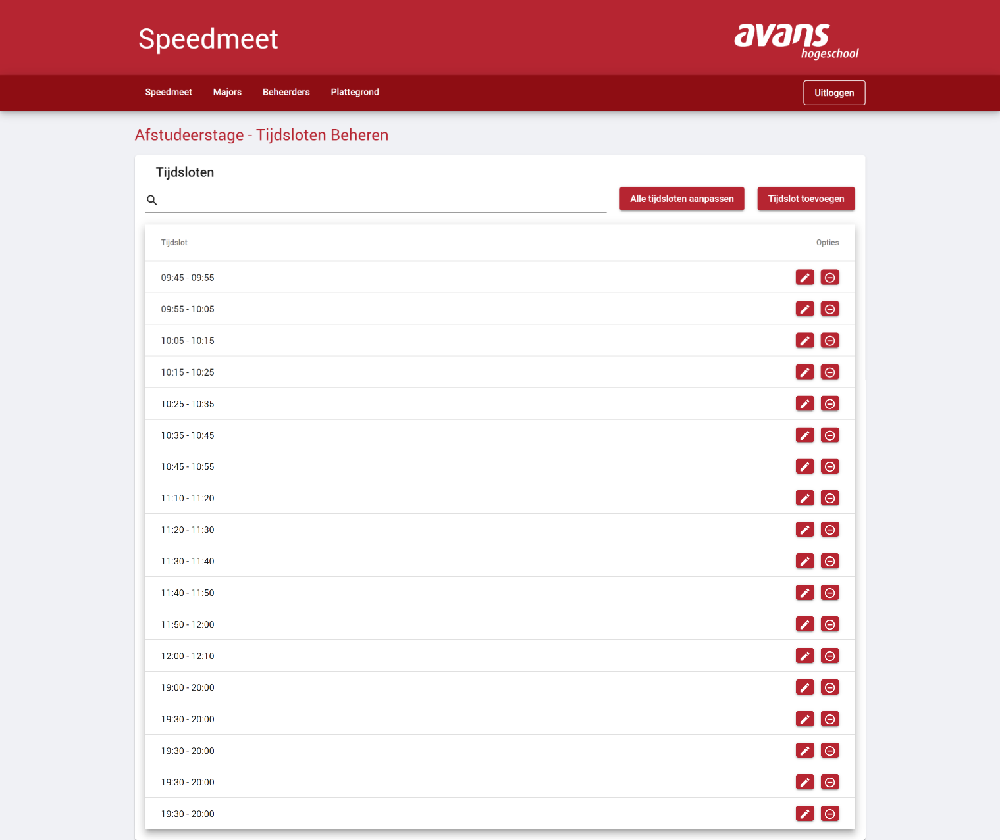
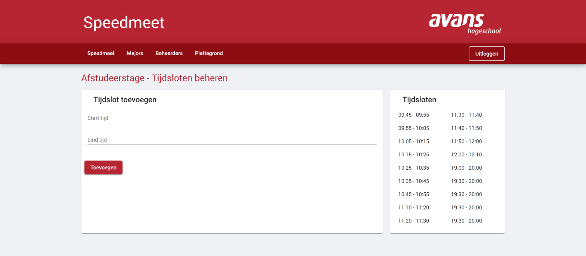
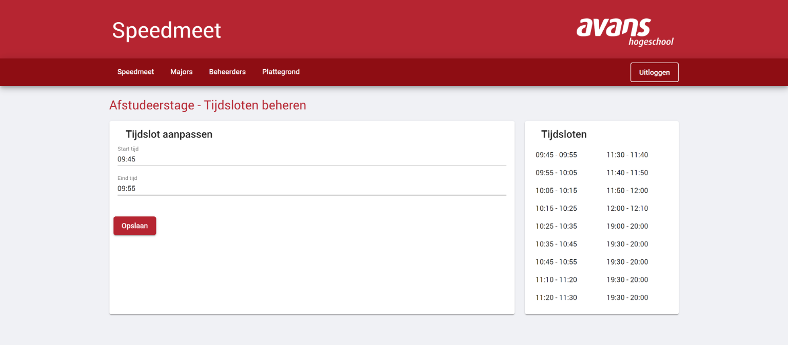
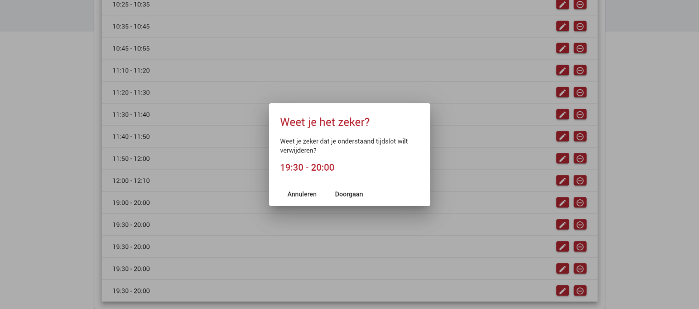

# Tijdsloten beheren

In dit overzicht zie je een overzicht van alle tijdsloten die er per tafel worden aangemaakt. Op het moment dat je hier een wijziging maakt, word deze meteen doorgevoerd voor alle tafels.

Als er een student is ingeschreven voor een tijdslot, is het niet meer mogelijk om het gekozen tijdslot te verwijderen.

## Tijdslot toevoegen

Op deze pagina kun je een extra tijdslot toevoegen. Er wordt gevalideerd op het formaat en of het tijdslot al dan niet bestaat. Je dient voor ieder tijdslot een starttijd en eindtijd in te vullen.

Het formaat van het tijdslot is als volgt:
HH:MM (dus bijvoorbeeld 09:00)

## Alle tijdsloten aanpassen

Op deze pagina is het mogelijk om **alle** tijdsloten een aantal minuten op te schuiven. Om te tijdsloten naar voren op te schuiven vul je een positief getal in (dus: 5). Wil je de tijdsloten naar achter opschuiven? Vul dan een negatief getal in (dus: -5).

## Tijdslot wijzigen

Om op deze pagina te komen dien je op de overzichtspagina op het potlood icoon te klikken. Op deze pagina kun je een specifiek tijdslot wijzigen. Net zoals bij het toevoegen van een tijdslot moet je rekening houden met de andere tijdsloten en dien je je te houden aan het formaat (HH:MM). Het is verplicht om een starttijd en eindtijd op te geven en hier word dan dus ook op gevalideerd.

## Tijdslot verwijderen

Het is tevens mogelijk om een tijdslot te verwijderen. Wanneer je op de overzichtspagina op het rode icoontje(cirkel met een streepje er in) klikt dan komt er een popup tevoorschijn waarmee je je keuze moet bevestigen.

**Let op:** Het is niet mogelijk om een tijdslot te verwijderen indien er studenten op ingeschreven staan. 

